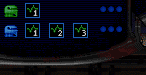

If you are New to Silencer, it is STRONGLY RECOMMENDED that you play the TUTORIAL MISSIONS that are provided, as well as reading this document.

## Story

Location: Base Arsia Mons, Surface Temperature: -7C

It is the near future on Mars, and the government is up to no good. As a result, there are powers that are trying to overthrow the government, known as Silencers. They are hackers and brokers of secrets, and they are not friendly to each other. Choose your agency well, and be wary and fast.

## Getting Into The Game

If you want to change graphics options or the controls, go to "OPTIONS".

When you're ready to begin taking on other players, go to "START GAME".

You will be taken to a screen where you must enter a valid zsilencer.com Account Name and Password. If you do not have an Account, it will go through the steps of making one.

After you log in, you will need to select an Agent from the top left corner. Here, you can view and manage your agents.

You will be put into the "Lobby", along with all of the other players who are not currently in a game. Your agent's stats will be shown in the upper left corner. The main chat area is in the lower left area. The upper right area shows the games that can be joined, and clicking on a game will show information about it in the lower right corner. You can also create a new conflict (game).

To join a game, click on a conflict in the upper-right area; and then click the "JOIN CONFLICT" button in the lower right corner. This will take you to the game-specific area, where all players in a game wait for the conflict to start.

In the game-lobby, you will see a similar layout to the one in the main lobby. The chat area is in the lower left, and your agent's stats are in the upper left corner. However, the right hand side of the screen has several new things.

First, you will notice a large list of everyone who's in the game currently. If several people are part of the same organization, they will default to being on the same team (and their efforts will be combined in the game). If their names are separated by a small blank space, then they are on different teams. To change whether or not your efforts are combined with others from your organization, use the "CHANGE TEAMS" button to the left of the agent list.

NOTE: People of different organizations can never work together.

The "TECH" button opens up an area where you can assign your available tech. slots to different inventory items and weapon ammo types. These things can be bought at special terminals in the game. For more info. on these items, see his is the basic object of the game. Y section below. If you're in "TECH" view and you want to go back to the player list, click the "TEAM" button.

When you are ready to play, hit the "READY" button. When all players have pressed their "READY" buttons, the game's creator can start the game!

## Movement

In Silencer, your agent has 3 modes of travel: On foot, by jetpack, or with the "tuck and roll" maneuver. Your Silencer Agent can also duck, jump, and climb ladders and ledges - to avoid fire, or maneuver around the map.

Use your jetpack by holding down the [Q] key. You can thrust to the side by holding [Q] and pressing in the desired direction. Note that you will always travel in a diagonal arc this way - you never go straight sideways. If you want to traverse to the side by jetpack without gaining or losing altitude, you'll need to press and release the key repeatedly.

To use the "tuck and roll" maneuver, duck by pressing the “down arrow” key - then press to the left or right. This is a good way to avoid fire while still moving; although your pace is a little bit slower than normal.

Ladder Jump: To jump up from a ladder simply latch onto a ladder and press the jump key [tab]. While you're still in the air, press "up arrow" key to latch back onto the ladder. Doing this repeatedly has an advantage of going up ladders quickly.

## The Hud

The HUD in Silencer is designed to give you quick access to all the information about your agent, without cluttering up the main playing area. The HUD contains the following elements (in clockwise order):

|   Image     |     Bio     |
------------- | -------------
|   | The **Agent List** shows life-signs and organization affiliations (as well as team colors) of all agents. If an agent has a secret, their life-sign monitor turns white. If an agent is killed, their life-sign monitor shows a flat red line. The three dots next to each agent show the number of secrets they've found and retrieved. When one agent or team collects 3 secrets, the game is over. |
|   | Your **Inventory** shows icons and numbers representing what items you are carrying, and how much of each you have. The item that is the brightest is the currently selected item. Items with a number next to them indicate that you are carrying more than one of that type of object. |
|   | The **Files bar** shows how "full" of files your agent is. You get files whenever you hack, regardless of whether or not they count towards a secret. The more files you have when you run through the regenerator in your base, the more you get paid. |
|   | Your **Credit Balance** is how many credits you have available for spending on tech. items and ammo. |
| No Image | The **Shield Level Indicator** shows how much shield strength you have remaining. When this gets low, your body will begin to take damage; and will be much more susceptible to certain types of damage. |
|  | The **Fuel Gauge** drops as soon as you use your jetpack. It will continue to drop to empty, regardless of whether or not you use your jetpack again. Once the fuel is exhausted, you will NOT be able to use your jetpack again until the fuel is fully recharged. Fuel automatically recharges itself after a few moments. When the "LOW FUEL" light goes off, you can use the jetpack again. |
|  | The **Mini-map** is perhaps the most complex (and most useful) thing on your HUD. It can show you where you are, where your enemies are (red dots, if you've recently seen them), where known enemy bases are (rectangles, color-coded to each enemy agent), where hack-able terminals are (white crosses), where secrets are (blue crosses for your secrets, red crosses for enemy ones - or flashing circles around enemy dots, if they're being carried), and where explosions or fire-fights are going on (orange blips or areas). |
|  | Your **Fatigue Gauge** monitors how much stress you're putting on your agent. This is only active in games where fatigue has been turned on. |
|  | The **Health Meter** shows how much of your health you have remaining. When this drops to 0, you die and will have to wait a moment to re-spawn in your base before you can continue your mission. |
|  | The **Weapon Selection Area** shows an icon for your currently selected weapon, and draws an outlined box around the amount of remaining ammo for it. |
|  | The **Information List** shows your advancement towards finding the location of the next secret. Completed parts of the puzzle are in bright green; and the piece you are working on will flash while you hack. The information list is not visible when you haven't deployed a base door, or when you are currently waiting for the location of a secret. |

## Your Base

Your base is your sanctuary in this game; and its somewhat important that you keep it in good shape. Your first order of business when you get into the game, will be to deploy your base in a good area. A "good" area depends on your tactics; but remember these following things:

You DON'T want to have to run all the way to a remote corner of the map to deliver a secret or get paid for files.

You DON'T want to have to wade through government defenses or security to get to your base.

You DON'T want your base to be too far from hack-able terminals.

You DON'T want your base to be in an area that the enemy can blockade or infiltrate easily.

To deploy your base for the first time after starting a game, press the [W] key. To walk into your base, maneuver in front of it and press the [SPACE BAR].

Let's run down a brief list of what is in your base:

If you were to enter your base and head to the right, the first thing you would pass would be the regenerator / file-payout machine. This indestructible device both heals you as you run through it, as well as paying you for any files you have collected. It also is the most common place to re-spawn after being killed.

Continuing to the right, you'll pass the "Tech. Terminal", where you can buy items from your Tech slots (the green screen).

Beyond that, there is a ladder leading down (more on that in a moment).

Finally there is the Secrets Terminal at the extreme right. This is where you must deliver secrets to, in order to get credit for them.

**Remember**: you have to run all the way across your base to deliver a secret; and having an enemy lurk near that terminal can be disastrous. Also remember that you can infiltrate THEIR bases just as well as they can yours - but it DOES take away from time you could be hacking. You have to decide upon a balance between espionage and sabotage in Silencer.

At the bottom of the ladder I just mentioned, you'll find a lower level of your base. Each machine in this area controls a tech slot for items that you can buy. If an opponent manages to sneak into your base and destroy one of these machines, one or more of your tech slots will be unavailable until you repair things. You do so by "buying" the repair at the Tech. Terminal.

## Overall Gameplay

Silencer pits you against other players online. You are all vying for secrets, and trying to get rid of your competition through disguise, traps, and straight out shooting. At the same time, you need to beat them to the Secrets, and get the Secrets back to your base without getting killed. Use technology to your advantage, but choose your timing well.

You start with a blaster and a few laser charges, and the ability to disguise yourself as a civilian. Walk to a green terminal, and hit the space bar to start hacking. Within a few seconds, you will have a file, and may have part of the puzzle to where the Secret lies. The down side to hacking is that you are exposed! The enemy which is anyone with a gun, will see you hacking if you are disguised, and can take a shot at you while you are intent on the hack ...so, be careful. However, if you are not diguised, you're dead meat... they will know you in a minute. Run back to your base with the file, get some credits, and buy some tech or ammo. Now out you go again.

The techs you can buy are rather unique. You can get base defenses to repel intruders, viruses - take over robot guards or cannons, EMPs, bombs, rockets, and the list goes on and on. Each tech has its uses, and some have weaknesses. While a rocket can take out most attackers, it also tends to be a dead give-away for your location. Be warned.

The top left of the screen shows how many parts of the puzzle your team has found. Once all the parts are known, your team knows where the Secret is located. You will have to wait a bit for the location to be confirmed, then you need to run for it. In just a few more seconds, everyone else will know where to get the Secret. If that is not enough, the government will be able to find you within a few minutes of getting the Secret, and hunt you down. The game ends after you get 3 Secrets, or is lost when some other team gets all three Secrets.

## Agencies

### Noxis
The Noxis corporation terraformed the majority of the initial habitable sectors of Mars, and continues to do so, as well as producing and selling 70 percent of the breathable oxygen. Since they are widely known to the populace and government, they have taken steps to bolster their agent's health so they are better able to avoid detection. Training in bio-sporria rich environments, and possessing suits with advanced oxygen processors and filters, has given these agents improved physical abilites such as higher jumps, more stamina, and enhanced durability.

**Bonuses/Abilities**: +5 Jump, +3 Endurance.

### Static
The Guv first realized that there was a brain-drain about four years ago. Silently, the youngest talented computer specialists and high level programmers were disappearing and leaving the Guv without the technical support it required. They ended up creating Static as a technologically savvy anti-government agency, but many members are more interested in reinforcing their reputation as turbulently wild hackers with the best skills and techniques.

**Bonuses/Abilities**: +3 Hacking, Satellite ability (occasionally see all enemies on the mini-map).

### Caliber
Looking more like weekend fact-findersor trivia buffs than technological spelunkers, members of Caliber seem to be concerned with obtaining a broad range of general information. So while harvesting data may be only a hobby for their predominantly upper-class agents, even the simplest router checks give them what they want. For some reason, Caliber pays its members extremely well for even the most common files.

**Bonuses/Abilities**: +3 Contacts

### Lazarus
Like the mythical phoenix, the loose organization known as Lazarus has been resurfacing every hundred years and causing chaos in the larger urban areas of Mars. Whether it's belief in some higher power, an understanding of mystical truths, or something else entirely, no one oustide of the group is sure of their motives. Numerous witnesses of Lazarus attacks claim to have seen supposedly fatally wounded agents dust themselves off and continue their efforts, virtually undamaged.

Bonuses/Abilities: Resurrection ability. If you die, you'll have a random chance of resurrecting in your current location; instead of respawning in your base. Note that you resurrect with 0 shields.

### Black Rose
More like a dark force than a loose collection of humans, little is known of Black Rose. Something vibrant was taken from these people, and left in its place was a new form of sustenance. Its members seem to be misanthropic and have a penchant for using illegal compounds such as Hollowhead injections to cause extreme pain and internal withering in their victims. Shunned by even the most avaristic mercenaries, these agents work alone and yet still prosper due to some combination of ego and superlative talent.

**Bonuses/Abilities**: +2 Shield, Stealth ability - they can't be seen on radar; and base defenses won't fire upon them. NOTE: Due to their solitary and stealthy nature, Black Rose agents CANNOT work in teams.

## Technologies

Your agent is equipped to carry around items (up to 4 of each type), and deploy them at will. Items can be either picked up from dead enemies, or (more commonly) bought inside your base at a terminal. As you get items, they appear as icons in the upper right-hand corner of your screen. The brightest-green item is the item that is currently selected for deployment. To cycle through items and change which one is selected, use the [R] key. To deploy the item, press the [W] key.

| Icon | Item/Tech | Desc | Cost | Tech | Slots |
| ---- | --------- | ---- | ---- | ---- | ----- |
|  |  |  |  |  |  |

Laserammo	Laser	Immediately after shield technology was capable of dampening weapon effects, the Frost-Light laser was released. Two hits should remove any standard shield, but very little damage is done to an unshielded target.	150	1
Rocketammo	Rocket	Long range, high yield mini-warheads will devastate any unshielded opponent. Includes an attached camera for in-flight kill tracking.	250	2
Flamerammo	Flamer Ammo	Kills any unshielded target. No shield has been made that the Crucible flamer cannot ignore. Deadly at close range.	200	2
Poisonicon	Poison	Only available for Black Rose. A more devious strain of the Orion Flare, the Poison Flare incapacitates its victims in seconds and leaves them poisoned as well. Environmentally disastrous, but highly lethal.	100	1
Secpassicon	Security Pass	Only available for Caliber. Unlimited security access. Government agents will ignore you in the field.	1000	1
Healthicon	Health Pack	Only available for Noxis. A small portable boost for Noxis agents in the field. Restores lost health, but must be manually applied.	100	1
Virusicon	Virus	Only available for Static. A portable virus whipped up by the snotty underage hackers of Static. Gives you immediate control over cannons and robots in the field. May harm enemy in-base weapon stations.	400	1
Laztracticon	Lazarus Tract	Only available for Lazarus. The definitive and unquestionable truth about Mars' oddest and most powerful religious organization. Helpful in converting disbelieving citizens to your cause.	300	1
Bombicon	E. M. P Bomb	Upon detonation it emits a electromagnetic pulse that drops all shields in a several mile radius. The user is protected by a frequency modulator that comes with the device.	1000	4
Bombicon	Shaped Bomb	Derived from the plasma bomb, this bomb focus its destructive force upwards.	100	1
Bombicon	Plasma Bomb	An indiscriminate terrorist device capable of killing even a perfectly healthy opponent. A core explosion with multiple shrapnel tendrils, extremely lethal.	200	2
Plasdeticon	Plasma Detonator	A remote detonation device. Deploy in strategic locations and detonate from a safe distance.	200	2
Cannonicon	Fixed Cannon	A stationary laser turret with excellent offensive and defensive capabilities. This mechanical friend in the field can do your work for you.	200	1
Flareicon	Flare	The Orion Flare is a stationary mini-torch looks like a bomb in flight but has a more lingering effect. Useful for blocking off tight areas or herding enemies.	200	1
Cameraicon	Camera	A remote viewing device that allows an agent to monitor an area on his/her HUD. Can be discreetly removed in a puff of smoke. When secrecy is a way of life.	100	1
Basedooricon	Base Door	The ability to relocate the warp door to your base.	300	1
Basedeficon	Base Defense	Internal security systems to deter would-be ambushers. In-base laser turrets. Multiple purchases increase turret structure durability.	100	1
Insider Info	Your contacts on the inside can give you information about secrets. For a price of course.	500	1
Bombicon	Neutron Bomb	A portable neutron bomb that swiftly eliminates all opposition in the entire region. The only defense against it is to be in your base. Use with extreme caution.	4000	8

## Hacking

This is the basic object of the game. Your mission is to collect files, which give you information towards the location of a secret. If you stop in at your base after collecting files, you will get paid for the files you have collected. Once you've obtained all the information files for a secret, a location is slowly locked in for pickup of the secret. To get credit for the secret, you must go pick it up and return it to the proper terminal in your base.

To collect files, you'll need to hack into data terminals around the level. On your mini-map, you'll see white crosses. These represent the data terminals that can be hacked at the present moment. Small crosses are small data terminals, while large crosses are big data terminals (which yield 2 - 4 times the data, depending on your skill level; so they're very valuable). If you see a cross flashing, that means that a large data terminal at that location is getting ready to become hack-able.

To hack a system, simply walk in front of it and hit the [SPACE BAR]. Your agent will begin hacking the system. As soon as you begin hacking, a timer ticks down above the terminal - indicating how much time you have left before the terminal becomes inactive. This timer continues to tick down EVEN if you stop hacking! Interruptions during a hack attempt mean less files or information is collected.

**NOTE**: Even if you get fired upon during a hack, you may keep hacking. As long as your agent is glowing orange, you're still collecting information and files.

There are two times when hacking does NOT count towards a secret:

1. If you haven't deployed your initial base door at the start of a game, you won't get "credit" for the hacks you perform.

2. You don't get credit towards another secret, if you hack while a secret location is being determined already. You still rack up "files" in your HUD, however; and in your base you will be paid for the files you collect during this time.

There is one more way to collect files and secrets: off of the dead bodies of your enemies! If another agent has hacked a terminal but has not gone back to their base yet, you can kill them and pick up some of their files! These files don't count towards finding your secret, but you will get paid for them back at your base.

After an enemy agent has raided a data terminal for a SECRET, you can kill them and take their secret back to your base. It will count towards one of the three secrets you need to complete your mission.

Files from dead bodies look like black cylinders with electricity surging around them; and secrets look like white spheres.

NOTE: You can also pickup inventory items and ammo from fallen enemies.

### Large Terminals

Large terminals provide more information than small terminals. If you upgrade your contact to at least 1, you get a countdown timer on large terminals.

### Small Terminals
Hackingsmallterminal
Small amount of information but are more common than large terminals.

## Experience / Leveling

Your experience earned at the end of a game is determined by how you played during the game. Below is the calculation. + is experienced gained. - is experienced lost.

+ Kills * 35xp
- Deaths * 10xp
+ Secrets Returned * 125xp
+ Secrets Stolen * 200xp
+ Secrets Pickedup * 25xp
- Secrets Dropped * 10xp
+ Files Hacked / 50xp
+ Files Returned / 50xp
+ Fixed Cannons Destroyed * 10xp
+ Guards Killed * 5xp
+ Robots Killed * 8xp
+ Defense Killed * 10xp
- Civilians Killed * 2xp
+ (Blaster Hits / 3) * 1xp
+ (Laser Hits / 3) * 2xp
+ (Rock Hits / 3) * 3xp
At certain experience levels, you will be able to select (at the end of a game) a bonus to add to your character. Possible bonuses are described below:

Endurance: Increases Max. Health by 20 points.
Shield: Increases Max. Shield level by 20 points.
Jet Pack: Increases the time before the jet pack runs out of fuel.
Tech. Slot: Gives you an additional slot to use for inventory items that you can buy.
Hacking: Improves the amount of information towards each secret you get when you hack.
Contacts: Increases the amount of cash you receive for files by 10%.
NOTE: You can upgrade each bonus up to 5 times max.

## Secrets

It takes three secrets to win the game. You can either earn them by collecting files or stealing them your opponents. For each secret you return back to your base, the team is awarded 1000 credits including stolen secrets.

## Lobby Commands

These are commands you can run in the lobby.

/list: Gets you a list of players in the room.
/games: Gets you a list of active games.
/join #room: Join another room. Replace room with whatever room you want to join.
F5: Plays music in lobby

## In-game Special Keys

F1: See all players currently in the game as well as their stats.
F4: Stops playing music.
F5: Starts music.
T key: Press T to chat then press TAB to switch between talking to your team or everyone.
Help me expand this page. Email me at contact@arsiamons.io for any changes you'd like to see on here.
